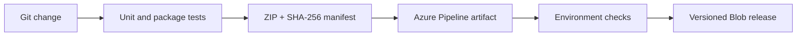

# Azure DevOps Data Delivery

[](https://github.com/Eswarprajapati/azure-devops-data-delivery/actions)

An Azure Pipelines delivery example for a Python data job: validate the code, run a sample workload, build a reproducible ZIP, publish a pipeline artifact, and optionally promote that artifact to Azure Blob Storage.



## Run locally

Python 3.11+, no third-party packages needed. Run from this repository:

```bash
python -m unittest discover -s tests -v
python data_job.py data/orders.csv demo/revenue.csv
python tools/build_release.py dist
```

The sample produces **2500 cents** of completed-order revenue. Cancelled orders do not contribute. Duplicate IDs, invalid dates, unknown statuses, and negative amounts fail the batch before replacing an existing output. Eight tests cover transformation failures, preservation of an existing output, reproducible packaging, and execution of the extracted release.

## Azure DevOps setup

1. Import the GitHub repository into an Azure DevOps Services YAML pipeline using `azure-pipelines.yml`.
2. The default run tests and builds only. `publishToAzure` defaults to `false`.
3. For promotion, create a private storage account/container, an Azure service connection using workload identity federation, and grant its identity **Storage Blob Data Contributor** at the release container scope.
4. Create the `data-platform-dev` environment. Configure approvals/checks in Azure DevOps before enabling promotion; YAML does not create approval policies.
5. Run from `main` with `publishToAzure=true`, the service connection name, storage account name, and container. Artifacts are uploaded under the build ID with overwrite disabled. The manifest is checked again before upload.

Promotion stores a release; it does not schedule or execute a production data job. Azure-hosted agents, pipeline permissions and environment checks require your Azure DevOps organization. Azure DevOps Server should use Build Artifacts instead of Pipeline Artifacts. Configure Azure Repos PR validation through branch policies if mirroring the repository there.

## Engineering choices

- Integer cents avoid floating-point money errors.
- Validation happens before output replacement; the file replacement is atomic on the same filesystem.
- Fixed ZIP timestamps and a SHA-256 manifest make release integrity observable. This is integrity checking, not cryptographic signing.
- GitHub Actions runs the same workload and tests for public verification. The Azure Pipelines service and optional Azure promotion need live credentials and have not been run here.

Synthetic portfolio example related to infrastructure automation and CI/CD experience. No employer code or customer data.

References: [Pipeline artifacts](https://learn.microsoft.com/en-us/azure/devops/pipelines/artifacts/pipeline-artifacts?view=azure-devops), [Azure CLI task](https://learn.microsoft.com/en-us/azure/devops/pipelines/tasks/reference/azure-cli-v2?view=azure-pipelines).
